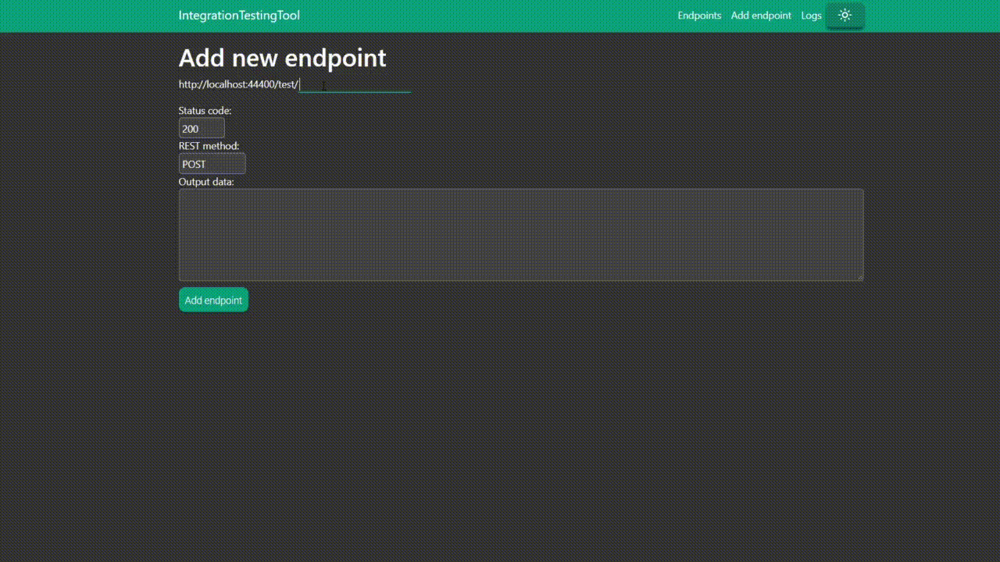

# IntegrationTestingTool

Web application that allows you to imitate endpoints of server when you have no access.

## Getting started

1. Setup application config at `.env` file (or keep it the same)
2. Run `docker-compose.yml` file

## Stack

* .NET Core 3.1
* React 16.14
* MongoDB 4.0
